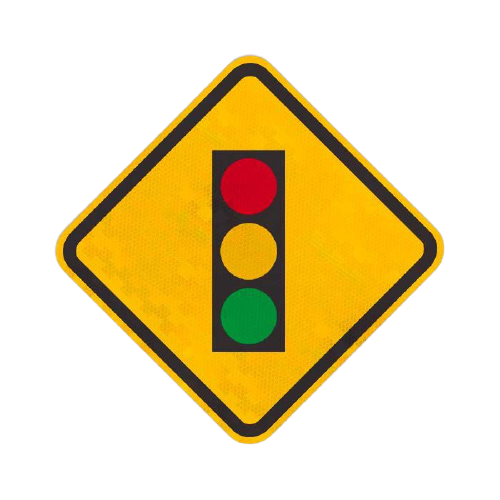
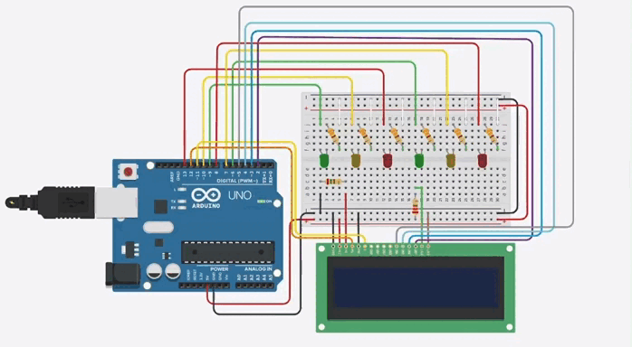

   

	<h3 align="center">Semáforos em um Cruzamento</h2>

<h3 align="center">
		✅ Status: concluído ✅
</h3>

 

## 📖 Sobre
Projeto realizado na disciplina de Laboratório de Hardware. Consiste em simular o funcionamento de dois semáforos em um cruzamento de ruas. Utilizando linguagem C++ nas suas funcionalidades e a ferramenta de modelagem 3D Tinkercad para a criação de circuitos que podem ser testados na placa Arduino Uno online.

## 🖥️ Demonstração

  

## 🛠 Tecnologias

As seguintes ferramentas foram usadas na construção do projeto:

- [Arduino](https://www.arduino.cc/reference/pt/)
- [Tinkercad](https://www.tinkercad.com/)
- [C++](http://www.cplusplus.com/)

